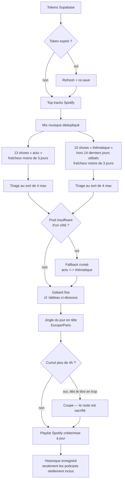

# Logique de génération de la playlist

Ce document décrit ce que fait `pnpm run generate <spotify_user_id>` (`src/generate.ts`), étape par étape. Généré manuellement pour l'instant (Phase 2) — l'automatisation quotidienne (`pg_cron`) arrive en Phase 3.

## Schéma

## Sélection des podcasts

Il n'existe **aucun signal de popularité exploitable côté API Spotify** : l'objet `Show` n'a pas de champ `popularity` (contrairement aux morceaux), et `/me/player/recently-played` ne remonte pas les épisodes écoutés. Impossible de calculer un vrai classement "les plus écoutés" — la sélection repose donc sur une **catégorisation manuelle** (`category` dans `src/config/podcast-shows.ts`) et un **tirage au sort**, plafonné à 4 de chaque côté.

### Actu (13 shows, 4 max/jour)

1. Les 13 shows `"actu"` sont tous tentés (`/shows/{id}/episodes`) — pas d'arrêt anticipé, il faut connaître l'ensemble des éligibles avant de tirer au sort.
2. Un show est éligible si son dernier épisode existe et a **moins de 3 jours** (`EPISODE_MAX_AGE_DAYS`).
3. **Tirage au sort de 4** parmi les éligibles (pas les 4 premiers de la liste). Pas de rotation : le contenu change tous les jours de toute façon, un même show peut revenir le lendemain.

### Thématique (15 shows, 4 max/jour)

1. Le pool de départ exclut les shows utilisés en podcast dans les **14 derniers jours** (`THEMATIC_ROTATION_LOOKBACK_DAYS`, via `playlist_history.show_ids`) — c'est la rotation, pour ne pas retomber sur les mêmes.
2. Sur ce pool restreint, même règle de fraîcheur (< 3 jours), puis **tirage au sort de 4** parmi les éligibles.

### Fallback croisé (symétrique)

- **Pas assez d'actus fraîches** (moins de 4 éligibles) → les places manquantes sont comblées par des thématiques tirées au sort mais non retenues.
- **Pas assez de thématiques éligibles** (moins de 4 dans la fenêtre de rotation, ou fraîcheur) → les places manquantes sont comblées par des actus tirées au sort mais non retenues.

Si le classement `actu`/`thematique` d'un show te semble faux (quelques cas limites tranchés à la main, ex. "Géopolitique" de France Culture est quotidien mais classé thématique par nature du contenu), corrige directement le champ `category` dans `podcast-shows.ts` — c'est la seule source de vérité.

**⚠️ Tension connue (fraîcheur)** : la règle des 3 jours s'applique aussi aux thématiques hebdomadaires ("Le Dessous des Cartes", "Les Couilles sur la table", les podcasts sport de L'Équipe...) — un show qui publie une fois par semaine n'est "frais" que ~3 jours sur 7, donc souvent exclu même quand son contenu n'a rien de périmé. Constaté en test : 6 des 15 thématiques exclues le même jour pour cette raison, comblées par le fallback croisé vers l'actu. Pas corrigé pour l'instant (pas demandé).

**⚠️ Tension connue (rotation)** : avec 15 shows thématiques et une exclusion de 14 jours, piocher 4/jour épuise le pool en ~4 jours — au-delà, plus rien n'est éligible jusqu'à ce que la fenêtre de 14 jours commence à "libérer" les plus anciens. Le fallback croisé comble alors avec de l'actu (déjà observé en test). Accepté tel quel par Baptiste le 2026-09-22.

## Pourquoi un show peut être absent sans erreur visible

`getLatestEpisode` (`core/podcast-source.ts`) retourne "pas de pick" pour un show dans 3 cas, tous loggés :

1. **Erreur API** (4xx/5xx).
2. **Dernier épisode trop vieux** (> 3 jours), avec la date.
3. **Aucun épisode exploitable** dans les 5 derniers renvoyés par `/shows/{id}/episodes?market=FR`.

Le cas 3 a eu un vrai bug corrigé le 2026-09-22 : Spotify peut renvoyer `null` pour un épisode précis dans le tableau `items` (restriction par épisode, indépendante du show) **sans que ce soit le premier élément** — le code ne regardait que `items[0]` et concluait à tort "aucun épisode sur le marché FR" dès que celui-ci était `null`, même quand un épisode valide et récent existait juste derrière. Repéré sur "Gaspard G" ([lien Spotify](https://open.spotify.com/show/5zhGjnzRr4On2lWMIgFQPm)) : `items[0]` était `null`, `items[1]` un épisode bien réel du 16 septembre. Corrigé en cherchant le premier élément non-`null` parmi les 5 récupérés (au lieu de se fier à l'index 0).

## Le gabarit du mix

Fixe (donné par Baptiste le 2026-09-22) : 2 actus d'affilée en ouverture (avant toute musique), puis 4 musiques entre chaque podcast en alternant actu/thématique, jusqu'à 4 actus + 4 thématiques placées. **Au-delà, plus aucun podcast** — la musique continue seule jusqu'à la coupe 4h.

| Position | Contenu                                           |
| -------- | ------------------------------------------------- |
| —        | Jingle du jour                                    |
| 1-2      | 2 × actu                                          |
| 3-4      | 2 × musique                                       |
| 5        | 1 × thématique                                    |
| 6-9      | 4 × musique                                       |
| 10       | 1 × actu                                          |
| 11-14    | 4 × musique                                       |
| 15       | 1 × thématique                                    |
| 16-19    | 4 × musique                                       |
| 20       | 1 × actu                                          |
| 21-24    | 4 × musique                                       |
| 25       | 1 × thématique                                    |
| 26-29    | 4 × musique                                       |
| 30       | 1 × thématique                                    |
| 31+      | reste de la musique, en continu (plus de podcast) |

Un slot "podcast" sans pick disponible ce jour-là (pool épuisé même après le fallback croisé) est simplement sauté — le gabarit continue, rien ne se décale.

## Détail par étape

| #   | Étape                 | Fichier                                  | Logique                                                                                                                                                                    |
| --- | --------------------- | ---------------------------------------- | -------------------------------------------------------------------------------------------------------------------------------------------------------------------------- |
| 1   | Auth                  | `storage/supabase-storage.ts`            | Token récupéré par `platform_user_id` (Spotify), rafraîchi si expiré (marge 60s)                                                                                           |
| 2   | Mix musique           | `generate.ts`                            | Les top tracks Spotify (`time_range=short_term`, jusqu'à 50), dédupliqués — répétition voulue, pas de découverte (cf. limitations plus bas)                                |
| 3   | Sélection podcasts    | `generate.ts` + `core/podcast-source.ts` | Voir sections dédiées ci-dessus                                                                                                                                            |
| 4   | Assemblage            | `generate.ts` (`buildMix`)               | Suit `MIX_TEMPLATE` (ci-dessus) ; le reste de la musique non consommée suit en continu                                                                                     |
| 5   | Jingle                | `config/jingles.ts`                      | 1 des 7 jingles officiels "C'est {jour}", calculé sur le fuseau `Europe/Paris`                                                                                             |
| 6   | **Coupe durée**       | `generate.ts`                            | La playlist assemblée est tronquée dès que le titre suivant ferait dépasser **4h** — les titres en tête survivent, ceux de fin sont sacrifiés en premier                   |
| 7   | Publication           | `providers/spotify.provider.ts`          | Playlist "Mon Daily" trouvée ou créée (+ pochette), forcée en privée, titres remplacés                                                                                     |
| 8   | Historique sauvegardé | `storage/supabase-storage.ts`            | `playlist_history.show_ids` : seulement les podcasts **réellement inclus après la coupe** (un pick tronqué n'a jamais été écouté, il ne doit pas compter pour la rotation) |

## ⚠️ Limitations connues (playlists éditoriales Spotify)

Baptiste voulait enrichir le mix musique avec 2 playlists éditoriales Spotify ("Hot Hits France" `37i9dQZF1DWVuV87wUBNwc`, une playlist découverte `37i9dQZEVXcEf1WT9Cq9sA`). **Essayé le 2026-09-22, puis retiré** : les deux renvoient 404 sur `GET /playlists/{id}`, y compris pour les métadonnées seules. Confirmé via la doc Spotify à jour (migration de février 2026, `references/changes/february-2026`) : _"playlist responses for non-user playlists will now only return metadata rather than the full contents"_ — une playlist qu'on ne possède pas (même suivie, même officielle) n'est plus exploitable via l'API. Même schéma que la dépréciation de `/recommendations` ([LRN-001](../.claude/memory/learnings/LRN-001.md)).

Aucun contournement officiel identifié (pas de "charts" public dans le Web API). **Reporté en Phase 6** (ROADMAP) — le code correspondant a été supprimé plutôt que laissé mort, récupérable via git si une piste apparaît.

## Décisions actées le 2026-09-22

- **Musique — répétition voulue** : les musiques les plus écoutées reviennent tous les jours. Deux pistes d'enrichissement essayées et retirées : découverte par genre et playlists éditoriales Spotify (bloquées côté API, cf. ci-dessus).
- **Podcasts — 4 actus + 4 thématiques, tirage au sort, fallback croisé** : gabarit fixe (cf. ci-dessus), plus aucun podcast au-delà (musique seule jusqu'à 4h). Rotation thématique sur 14 jours, acceptée telle quelle malgré la tension de pool évoquée plus haut.
- **Fraîcheur** : seuil à 3 jours (`EPISODE_MAX_AGE_DAYS`), commun aux 2 catégories — cf. tension connue ci-dessus pour les thématiques hebdomadaires.
- **Playlist plafonnée à 4h** : coupe par durée cumulée en fin de pipeline, pas de limite fixe sur le nombre de titres.
- **Fix** : `getLatestEpisode` cherchait un épisode uniquement à l'index 0 de la réponse Spotify, ratant les cas où Spotify renvoie `null` pour cet index précis alors qu'un épisode valide existe plus loin dans la liste — cherche maintenant le premier élément non-`null` parmi les 5 récupérés.
